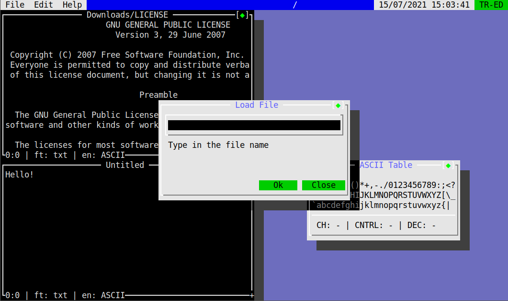

<h1 align="center">Trident Editor</h2>
<p align="center">A free terminal text editor for Linux</p>
<br>
<p align="center">
	<a href="./LICENSE">
		
	</a>
	<a href="https://github.com/LordsTrident/trident-editor/issues">
		
	</a>
	<a href="https://github.com/LordsTrident/trident-editor/pulls">
		
	</a>
	
</p>

## Compiling and running
Compile Trident Editor by running the compile file as bash:
```sh
bash compile
```
If you dont want it to check for g++ or dependencies, use the `-nc` parameter.
Then run tr-ed:
```
tr-ed
```

## Customizing
Trident Editor settings are stored under `~/.config/tr-ed/settings.scbl` (if the tr-ed folder or any of the default files do not exist, Trident Editor will create them when you run it).
The language used for config files is SCBL with a very simple syntax: `<function> <parameters>;`.
Find more about it here: https://github.com/LordsTrident/scbl

To change a setting, use the `set` function and then options as parameters. List of options:
- `tabsize <number>`: The amount of spaces tab represents (cant be below 1)
- `theme <themename>`: Changes the editor theme, themes can be found under the `~/.config/tr-ed/themes/` (extension is ignored in theme name)
- `cursorblink <boolean>`: Enables blinking of the cursor (`true`/`false`)

> Example: `set tabsize 4;`

### Themes
How to change the theme to one of the defaults is said above, but you can also create your own themes.
To do so, create a `.scbl` file under `~/.config/tr-ed/themes/` and once again use the `set` function to change options. The only option for themes is `color`

#### color
The color option wants a few more parameters, first one being one of the listed below:
- `background`: The editor backround color
- `foreground`: The editor text color
- `frameforeground`: The editor frame foreground color
- `framebackground`: The editor frame background color
- `keyword` (NOT DONE!): Language keywords highlight color
- `string` (NOT DONE!): Strings highlight color
- `number` (NOT DONE!): Numbers highlight color
- `boolean` (NOT DONE!): Booleans highlight color
- `datatype` (NOT DONE!): Language data types highlight color
- `std` (NOT DONE!): Standard language functions/namespaces highlight color
- `comment` (NOT DONE!): Comment highlight color
- `preproc` (NOT DONE!): Pre-processor directives
- `operators` (NOT DONE!): Pre-processor directives

The next parameter will be the color. List of colors:
- `black`
- `red`
- `green`
- `yellow`
- `blue`
- `magenta`
- `cyan`
- `white`
- `grey`
- `brightred`
- `brightgreen`
- `brightyellow`
- `brightblue`
- `brightmagenta`
- `brightcyan`
- `brightyellow`

> Example: `set color background black`

## To do
- Syntax highlighting
- Selection
- Copy/Cut/Paste
- Scroll bar
- Line counting
